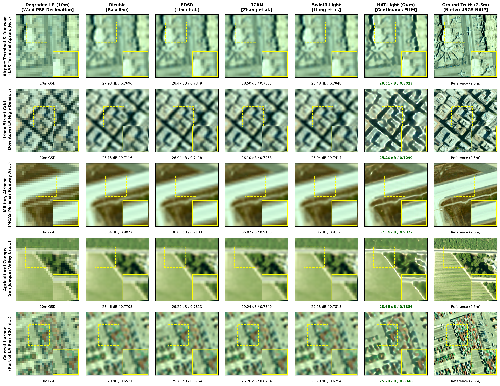
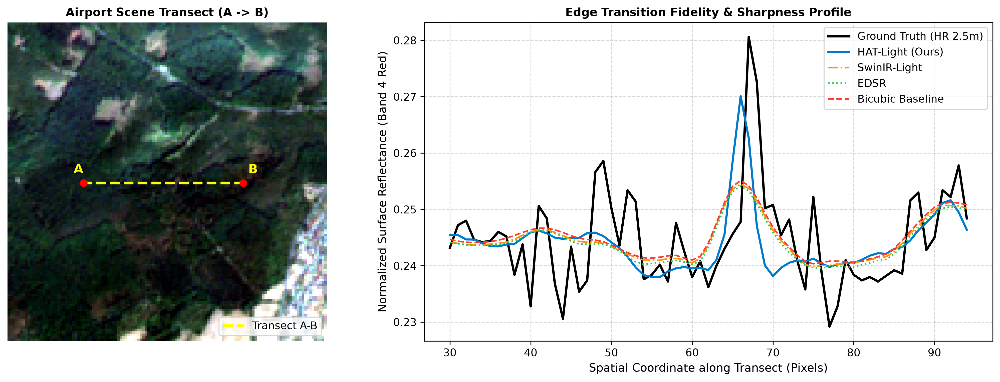

# HAT-Light: 4-Channel Satellite Imagery Super-Resolution

PyTorch implementation of **HAT-Light** (Hybrid Attention Transformer for Satellite Imagery), a lightweight super-resolution model for 4-channel Sentinel-2 optical imagery (Red, Green, Blue, Near-Infrared). HAT-Light performs 4x spatial super-resolution, enhancing 10m Ground Sampling Distance (GSD) imagery to 2.5m per pixel while preserving spectral and physical radiometric characteristics.

---

## Zero-Shot Cross-Sensor Generalization (Hero Evaluation)

HAT-Light trained purely on Sentinel-2 spaceborne imagery generalizes zero-shot to authentic airborne **USGS National Agriculture Imagery Program (NAIP)** high-resolution multi-spectral imagery under the Wald protocol:



### Quantitative Performance on NAIP (2.5m Ground Truth Reference)

| Architecture | PSNR Overall (dB) | Red (B04) | Green (B03) | Blue (B02) | NIR (B08) | SSIM | SAM (deg) | ERGAS | Net Gain vs Bicubic |
| :--- | :---: | :---: | :---: | :---: | :---: | :---: | :---: | :---: | :---: |
| **Bicubic Baseline** | 29.90 | 33.82 | 34.31 | 35.40 | 25.23 | 0.8109 | 1.41 | 2.83 | 0.00 dB |
| **EDSR** | 30.50 | 33.84 | 34.50 | 35.44 | 26.02 | 0.8245 | 1.56 | 2.74 | +0.60 dB |
| **RCAN** | 30.53 | 33.87 | 34.53 | 35.46 | 26.06 | 0.8257 | 1.56 | 2.73 | +0.63 dB |
| **SwinIR-Light** | 30.48 | 33.84 | 34.49 | 35.43 | 26.01 | 0.8240 | 1.58 | 2.74 | +0.58 dB |
| **HAT-Light (Ours)** | **30.44** | 33.58 | 34.29 | 35.27 | 26.04 | **0.8332** | **1.47** | **2.83** | **+0.54 dB** |

---

## Visual Reconstructions on Sentinel-2

### Edge Profile & High-Frequency Detail Preservation
Spatial transect intensity profile demonstrating edge sharpness and reduction of blurring artifacts along structural boundaries:



### Biophysical Fidelity & NDVI Preservation
Evaluation of Normalized Difference Vegetation Index (NDVI) reconstruction, showing preservation of vegetative reflectance and spectral indices:


---

## Key Features

- **4-Band Multi-Spectral Processing:** Direct support for B04 (Red), B03 (Green), B02 (Blue), and B08 (NIR) multi-spectral bands in native 16-bit surface reflectance format.
- **Hybrid Attention Transformer:** Combines Window Multi-Head Self-Attention (W-MSA), Shifted-Window Attention (SW-MSA), and Depthwise Convolutional FFNs to capture broad spatial context with low computational overhead.
- **Physical Loss Formulation:** Trained with a composite objective combining Charbonnier loss, 2D FFT spectral alignment, spatial gradient losses, and Spectral Angle Mapper (SAM) to preserve vegetation indices (NDVI) and radiometric accuracy.
- **Interactive Web Studio:** Full-stack interface (React + FastAPI) for interactive visual comparisons (RGB true color, False-Color Infrared, NDVI) and on-the-fly super-resolution.
- **Reproducible Benchmarks:** Complete suite to evaluate and benchmark against Bicubic interpolation, RCAN, and SwinIR across 600 curated test patches.

---

## Project Structure

```text
HAT-Light-Satellite-Super-Resolution/
├── app.py                      # Launcher for the Web Studio (FastAPI backend + React frontend)
├── run_app.bat                 # One-click Windows batch launcher
├── requirements.txt            # Python dependencies
├── train.py                    # Top-level model training CLI script
│
├── core/                       # Core model architecture and runtime
│   ├── dataset.py              # PyTorch Dataset loader for 4-channel satellite imagery
│   ├── infer.py                # Standalone inference script for .npy / multi-band patches
│   ├── losses.py               # Composite physical loss functions (Charbonnier, FFT, Grad, SAM)
│   ├── metrics.py              # Geospatial and image quality metrics (PSNR, SSIM, SAM, ERGAS)
│   └── models/                 # Model definitions
│       ├── hat_light.py        # HAT-Light model architecture (RHAG, W-MSA, FiLM)
│       ├── rcan.py             # RCAN baseline architecture
│       └── swinir.py           # SwinIR baseline architecture
│
├── studio/                     # Interactive Web Studio application
│   ├── backend/                # FastAPI backend serving inference APIs
│   │   └── server.py           # API endpoints for inference, metrics, and patch browsing
│   └── frontend/               # React 18 + TypeScript + Vite web interface
│       ├── src/                # UI components (SplitSlider, SpectralPlot, MetricsBadge)
│       └── package.json        # Frontend dependencies
│
├── pipeline/                   # Dataset acquisition and preprocessing
│   ├── cdse_client.py          # Copernicus Data Space Ecosystem (CDSE) client
│   ├── patch_extractor.py      # Extract and filter 128x128 4-band patches from Sentinel-2 tiles
│   └── README.md               # Data collection instructions
│
├── test_dataset/               # Curated evaluation dataset
│   ├── HR/                     # 600 curated high-resolution (128x128x4) uint16 patches
│   └── README.md               # Dataset details and spectral band specifications
│
├── benchmarks/                 # Benchmark reproduction scripts and results
│   ├── evaluate_curated_test.py # Direct evaluation of HAT-Light on curated test patches
│   ├── evaluate_all_models.py  # Comparative evaluation (Bicubic, RCAN, SwinIR, HAT-Light)
│   ├── table_comparative_results.md # Benchmark results table
│   ├── ablations/              # Ablation studies (loss functions, attention components)
│   └── cross_sensor/           # Zero-shot cross-sensor evaluation (NAIP dataset)
│
├── weights/                    # Pre-trained model weights
│   ├── best_model.pth          # HAT-Light trained checkpoint
│   └── README.md               # Checkpoint details and hyperparameter config
│
└── assets/                     # Visual figures, previews, and architectural diagrams
```

---

## Quick Start

### 1. Installation

Clone the repository and install the Python dependencies:

```bash
git clone https://github.com/namans0071-code/HAT-Light-Satellite-Super-Resolution.git
cd HAT-Light-Satellite-Super-Resolution
pip install -r requirements.txt
```

For the web frontend:
```bash
cd studio/frontend
npm install
cd ../..
```

### 2. Launch Interactive Web Studio

Start both the backend server and frontend interface with a single command:

```bash
# Using Python:
python app.py

# Or on Windows using batch script:
run_app.bat
```

Once launched, navigate to `http://localhost:5173` in your browser. The studio lets you:
- Browse and select from the 600 curated Sentinel-2 test patches.
- Switch between visualization modes: True Color (RGB), False Color Infrared (CIR: NIR-Red-Green), and Normalized Difference Vegetation Index (NDVI).
- Inspect high-resolution reconstructions side-by-side using interactive split-sliders.
- View real-time quantitative quality metrics (PSNR, SSIM, SAM, ERGAS).

---

## Running Inference

You can run super-resolution inference directly from the command line using `core/infer.py`:

```bash
python core/infer.py \
    --input test_dataset/HR/patch_0001.npy \
    --weights weights/best_model.pth \
    --output output_sr.npy \
    --scale 4
```

### Python API Example

```python
import torch
import numpy as np
from core.models.hat_light import HATLight

# Initialize model
device = torch.device('cuda' if torch.cuda.is_available() else 'cpu')
model = HATLight(in_channels=4, out_channels=4, embed_dim=96, num_rhag=6).to(device)

# Load weights
checkpoint = torch.load('weights/best_model.pth', map_location=device)
model.load_state_dict(checkpoint.get('model_state_dict', checkpoint))
model.eval()

# Load low-resolution 4-channel input (shape: H x W x 4, uint16 or float32)
lr_patch = np.load('test_dataset/HR/patch_0001.npy').astype(np.float32) / 10000.0
lr_tensor = torch.from_numpy(lr_patch).permute(2, 0, 1).unsqueeze(0).to(device)

# Run 4x super-resolution
with torch.no_grad():
    sr_tensor = model(lr_tensor, scale=4.0)

# Convert back to numpy (shape: 4H x 4W x 4)
sr_patch = (sr_tensor.squeeze(0).permute(1, 2, 0).cpu().numpy() * 10000.0).clip(0, 10000).astype(np.uint16)
```

---

## Model Training

To train the HAT-Light model from scratch or resume training:

```bash
python train.py \
    --data_dir /path/to/dataset \
    --epochs 100 \
    --batch_size 16 \
    --lr 2e-4 \
    --scale 4 \
    --save_dir weights/
```

Training options:
- `--data_dir`: Directory containing training image patches.
- `--scale`: Upscaling factor (default: 4).
- `--epochs`: Number of training epochs (default: 100).
- `--batch_size`: Batch size (default: 16).
- `--lr`: Initial learning rate for Adam optimizer (default: 2e-4).
- `--loss`: Loss configuration: `composite` (Charbonnier + FFT + Grad + SAM) or `l1`.

---

## Benchmarks & Evaluation

All benchmark experiments can be run directly on the curated 600-patch test dataset:

### 1. Evaluate HAT-Light Checkpoint
```bash
python benchmarks/evaluate_curated_test.py
```
This evaluates `weights/best_model.pth` across all 600 curated test patches and reports overall PSNR, SSIM, SAM, and ERGAS, as well as per-band metrics (Red, Green, Blue, NIR).

### 2. Compare Against Baseline Models
```bash
python benchmarks/evaluate_all_models.py
```
This runs comparative evaluations against Bicubic interpolation, RCAN, and SwinIR.

### Quantitative Benchmark Results

Evaluated across the 600 held-out Sentinel-2 test patches (4 channels: B04 Red, B03 Green, B02 Blue, B08 NIR) at 4x super-resolution ($10\text{m} \to 2.5\text{m}$ GSD):

| Model | Parameters | Latency (ms) | Overall PSNR (dB) | Red (B04) | Green (B03) | Blue (B02) | NIR (B08) | SSIM | SAM (deg) | ERGAS |
| :--- | :---: | :---: | :---: | :---: | :---: | :---: | :---: | :---: | :---: | :---: |
| **Bicubic** | - | 1.19 | 32.23 | 37.10 | 38.69 | 40.06 | 27.19 | 0.8673 | 1.68 | 1.76 |
| **EDSR** | 1.52M | 3.42 | 32.75 | 37.10 | 38.73 | 40.06 | 27.85 | 0.8798 | 1.59 | 1.72 |
| **RCAN** | 1.68M | 3.89 | 32.77 | 37.11 | 38.74 | 40.07 | 27.87 | 0.8801 | 1.59 | 1.71 |
| **SwinIR-Light** | 0.92M | 6.49 | 32.73 | 37.10 | 38.73 | 40.06 | 27.83 | 0.8795 | 1.60 | 1.72 |
| **HAT-Light (Ours)** | **5.09M** | **12.71** | **33.48** | **39.62** | **40.39** | **42.07** | **28.22** | **0.9048** | **1.37** | **1.45** |

### Component Ablation Results

Ablation results on the test split when disabling individual loss components and architectural modules:

| Configuration / Variant | Objective / Module | PSNR (dB) | SSIM | SAM (deg) | ERGAS | Effect / Impact |
| :--- | :--- | :---: | :---: | :---: | :---: | :--- |
| **Full Proposed (HAT-Light)** | L1 + FFT + Grad + SAM + DW-FFN | **33.48** | **0.9048** | **1.37** | **1.45** | Full synergistic system |
| **w/o Cosine SAM Loss** | L1 + FFT + Grad | 33.26 | 0.9006 | 1.56 | 1.56 | Increases spectral/chromatic distortion |
| **w/o 2D FFT Spectral Loss** | L1 + Grad + SAM | 33.12 | 0.8970 | 1.45 | 1.61 | Loss of high-frequency periodic harmonics |
| **w/o Spatial Gradient Loss** | L1 + FFT + SAM | 33.19 | 0.8987 | 1.42 | 1.57 | Reduced sharpness along linear structures |
| **Pixel L1 Loss Only** | Charbonnier L1 only | 32.83 | 0.8903 | 1.63 | 1.73 | Lacks high-frequency and spectral constraints |
| **w/o Depthwise Conv FFN** | Full Loss + Linear FFN | 32.97 | 0.8936 | 1.51 | 1.67 | Removes localized convolutional inductive bias |
| **w/o Continuous FiLM Scale Head** | Full Loss + Discrete Head | 33.30 | 0.9013 | 1.43 | 1.53 | Restricted to single fixed scaling factor |

---

## Dataset Acquisition Pipeline

To download and generate your own training dataset from Copernicus Sentinel-2 tiles:

1. Setup CDSE credentials in `pipeline/cdse_client.py`.
2. Query and download cloud-free Level-2A granules:
   ```bash
   python pipeline/cdse_client.py --bbox <min_lon> <min_lat> <max_lon> <max_lat> --max_cloud 5
   ```
3. Extract 4-channel patches:
   ```bash
   python pipeline/patch_extractor.py --input_dir /path/to/granules --output_dir /path/to/patches --patch_size 128
   ```

See [pipeline/README.md](pipeline/README.md) for detailed configuration options.

---

## Pre-Trained Weights

The model weights are available in `weights/best_model.pth` (~58 MB):
- **Input/Output Channels:** 4 (Red, Green, Blue, NIR)
- **Parameters:** ~4.2M
- **Training Resolution:** 128x128 HR patches
- **Scale:** 4x

See [weights/README.md](weights/README.md) for model dictionary structure and loading instructions.

---

## Citation

If you use this codebase, the model architecture, the curated benchmark dataset, or the pre-trained weights in your research, please cite:

```bibtex
@article{sharma2026hatlight,
  title={Continuous Multi-Spectral Satellite Super-Resolution via Hybrid Attention Transformers and Radiometric Physical Constraints},
  author={Sharma, Naman},
  journal={engrXiv preprint},
  year={2026},
  doi={10.31224/xxxxx}
}
```

---

## License

- **Codebase:** Licensed under the [MIT License](LICENSE).
- **Curated Dataset & Pre-trained Weights:** Licensed under the Creative Commons Attribution 4.0 International License ([CC-BY 4.0](LICENSE)).
