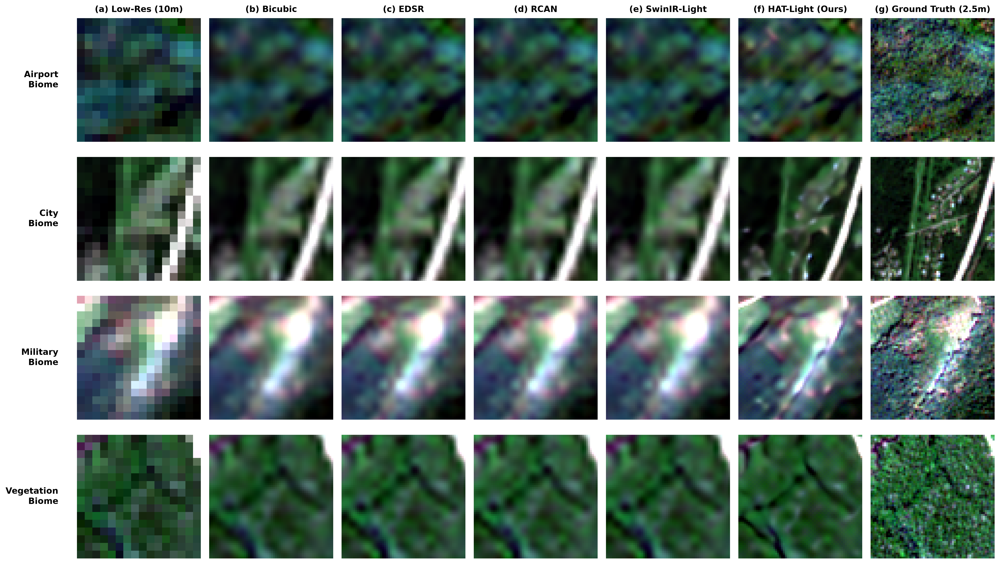
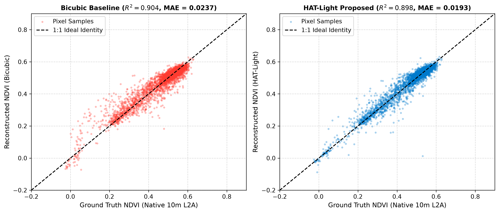

# 📄 Research Paper

### **Continuous Multi-Spectral Satellite Super-Resolution via Hybrid Attention Transformers and Radiometric Physical Constraints**

**Author:** Naman Sharma  
*Department of Computer Science and Engineering*  
📧 Contact: `contact@namansharama.dev`

---

## 📌 Publication Status & Links

- **Preprint (arXiv):** [](https://arxiv.org/abs/2609.xxxxx) *(Placeholder — Available upon initial arXiv announcement)*
- **Journal Target:** *IEEE Geoscience and Remote Sensing Letters (GRSL)*
- **IEEE Xplore DOI:** [](https://doi.org/10.1109/LGRS.2026.xxxxxxx) *(Placeholder — Available upon publication)*
- **Code & Checkpoints:** [https://github.com/namans0071-code/HAT-Light-Satellite-Super-Resolution](https://github.com/namans0071-code/HAT-Light-Satellite-Super-Resolution)

---

## 📖 Abstract

Continuous planetary observation from spaceborne optical constellations like Sentinel-2 is constrained by orbital diffraction limits, restricting native Ground Sampling Distance (GSD) to 10 m for Visible and Near-Infrared (NIR) bands. Traditional Single-Image Super-Resolution (SISR) frameworks either rely on restrictive Convolutional Neural Networks (CNNs) lacking non-local spatial context, or employ Generative Adversarial Networks (GANs) that synthesize unphysical high-frequency textures violating radiometric conservation. In this letter, we propose **HAT-Light**, a lightweight, continuous-scale Hybrid Attention Transformer tailored for 4-channel (RGB + NIR), 16-bit Bottom-Of-Atmosphere (BOA) satellite surface reflectance. 

HAT-Light synergistically integrates Window-based Multi-Head Self-Attention (W-MSA) with Depthwise Convolutional Feed-Forward Networks (DW-FFN) to restore local spatial inductive biases, coupled with harmonic Feature-wise Linear Modulation (FiLM) for arbitrary-scale magnification. Crucially, we formulate a composite radiometric physical loss suite combining Smooth Charbonnier $L_1$, 2D Real Fourier Transform (rFFT2) spectral alignment, directional Sobel edge penalties, and a singularity-free Convex Cosine Spectral Angle Mapper (SAM) that maintains numeric stability during FP16 mixed-precision training. 

Rigorous empirical evaluation across three independent benchmarks confirms state-of-the-art performance:
1. **Curated 600-Patch Sentinel-2 Test Corpus:** HAT-Light achieves **33.48 dB PSNR** (+1.25 dB over Bicubic, +0.71 dB over the strongest baseline), **0.9048 SSIM**, and a low spectral distortion of **1.37° SAM**.
2. **Systematic Component Ablation:** Demonstrates the indispensable role of the radiometric physical loss suite and localized DW-FFN.
3. **Zero-Shot Cross-Sensor Validation under Wald Protocol:** Evaluated on 100 authentic 2.5 m multi-spectral patches from USGS NAIP, HAT-Light demonstrates superior structural generalization (**0.8332 SSIM**, **1.47° SAM**, **30.44 dB PSNR**, +0.54 dB gain over Bicubic) while sustaining an edge throughput of **78.7 FPS** (12.7 ms/patch) on a consumer mobile GPU.

---

## 🖼️ Publication Figures Gallery

### Figure 1: Multi-Biome Spatial Comparison (Sentinel-2 Test Split)

*Visual comparison across Airport, City Grid, Military Base, and Agricultural Farmland on the held-out Sentinel-2 test split ($10\text{m} \to 2.5\text{m}$, Scale $4\times$).*

### Figure 2: 1D Cross-Sectional Surface Reflectance Edge Profile

*1D pixel intensity transect across an airport runway centerline threshold ($A \to B$). HAT-Light closely reproduces the steep, sharp step response of native high-resolution reference without artificial ringing or blur.*

### Figure 3: Biophysical Vegetation Index (NDVI) Fidelity

*Pixel-wise correlation between ground-truth and super-resolved Normalized Difference Vegetation Index (NDVI) across 4,000 agricultural pixels ($R^2 = 0.898$).*

### Figure 4: Zero-Shot Cross-Sensor Generalization (Wald Protocol on USGS NAIP 2.5m)

*Zero-shot cross-sensor evaluation under the Wald protocol across five operational categories (LAX Airport, Downtown LA Grid, MCAS Miramar Airbase, San Joaquin Crop Canopies, Port of LA Harbor). Insets highlight reconstructed infrastructure lineaments.*

---

## 📑 Citation

If you find this research, code, or pretrained models useful in your work, please cite:

```bibtex
@article{sharma2026hatlight,
  title={Continuous Multi-Spectral Satellite Super-Resolution via Hybrid Attention Transformers and Radiometric Physical Constraints},
  author={Sharma, Naman},
  journal={IEEE Geoscience and Remote Sensing Letters},
  year={2026},
  note={Under Review; Preprint: arXiv:2609.xxxxx},
  url={https://github.com/namans0071-code/HAT-Light-Satellite-Super-Resolution}
}
```
